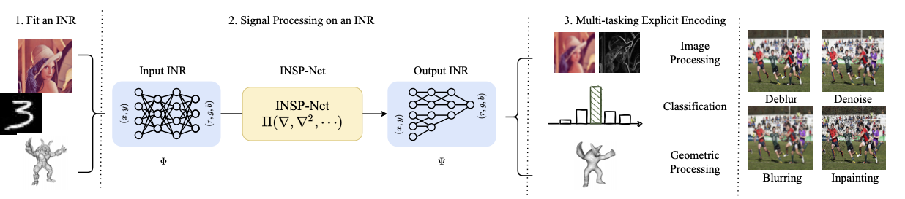
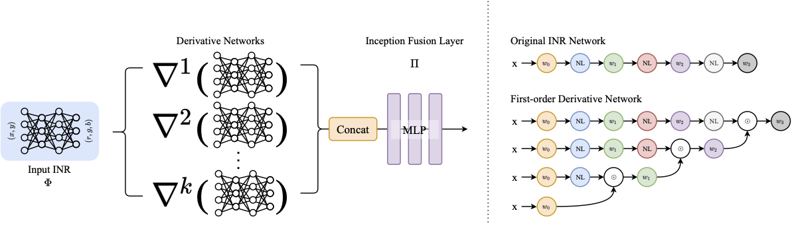

# Signal Processing for Implicit Neural Representations

[](https://opensource.org/licenses/MIT)

The official implementation of NeurIPS 2022 paper ["Signal Processing for Implicit Neural Representations"]().

Dejia Xu*, Peihao Wang*, Yifan Jiang, Zhiwen Fan, Zhangyang (Atlas) Wang

[[Paper]]() [[Website]](https://vita-group.github.io/INSP)

## Method Overview





## Environment

You can then set up a conda environment with all dependencies like so:

```
conda env create -f environment.yml
conda activate INSP
```

## High-Level structure

- Fit INR
- Export gradients for INR
- Train INSP-Net
- Inference INSP-Net

## Citation

```
@inproceedings{Xu_2022_INSP,
    title={Signal Processing for Implicit Neural Representations},
    author={Xu, Dejia and Wang, Peihao and Jiang, Yifan and Fan, Zhiwen and Wang, Zhangyang},
    booktitle={Advances in Neural Information Processing Systems (NeurIPS)},
    year={2022}
}
```

